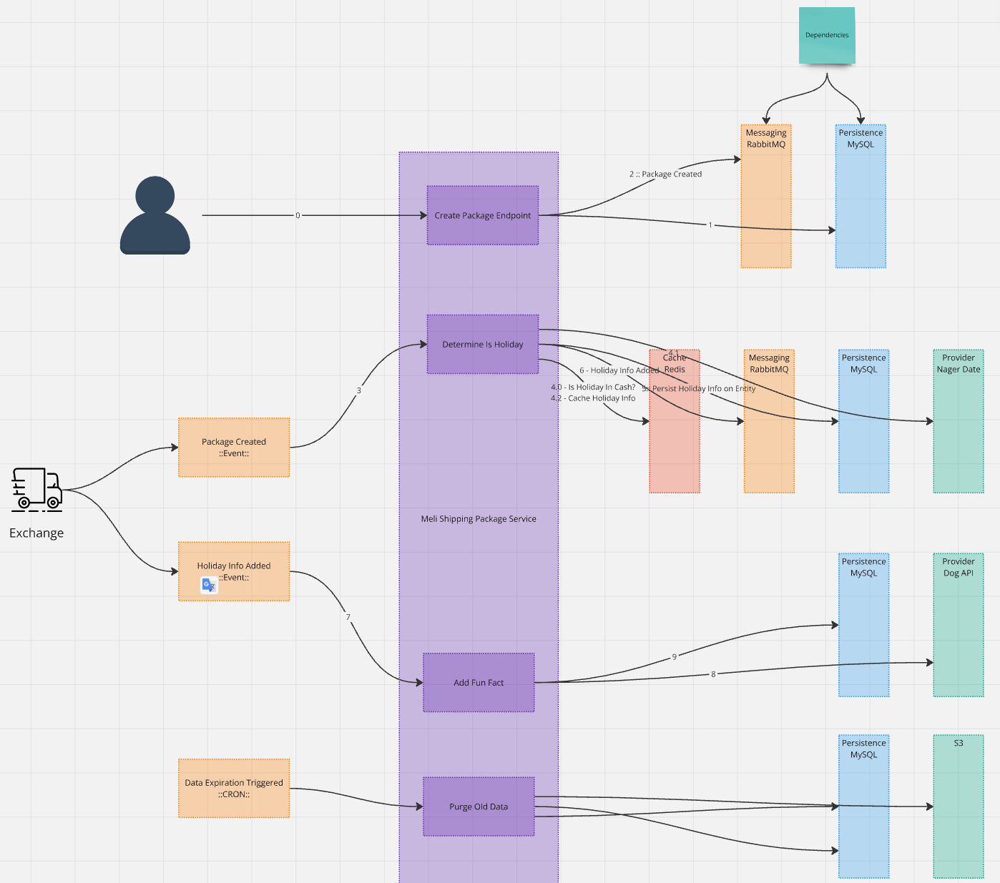
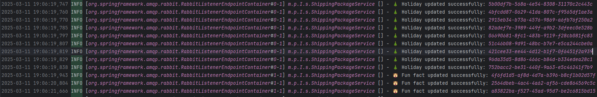

# Inbound - Sistema de Rastreamento de Pacotes

Descrição

Este projeto é um sistema de rastreamento de pacotes desenvolvido com Java Spring Boot. Ele permite o registro e monitoramento de eventos de rastreamento para pacotes, utilizando bancos de dados, cache Redis, filas RabbitMQ e logs estruturados.

Tecnologias Utilizadas

- Java 21
- Spring Boot 3
- Spring Data JPA (com MySql)
- Spring Cache (com Redis)
- RabbitMQ (Mensageria)
- Logback (Configuração de logs)
- JUnit 5 e Mockito (Testes)

# Como Executar o Projeto

Dependências do Projeto

- MySQL
- Redis
- RabbitMQ

## Passos para execução:

1. Clone o repositório:
```

git clone <https://github.com/VitorBrazSilva/logistics.package.inbound.git>

```
2. Execute os serviços necessários:
```
docker-compose up -d
```
3. Verificar a disponibilidade do serviço através do Healthcheck:

```
curl --location 'http://localhost:8080/actuator/health'
```
# Estrutura do Projeto

```
src/main/java/mercadolivre/processoseletivo/Inbound/
│── client/        # Apis Externas
│── config/        # Configurações do projeto (Async, Cache, RabbitMQ, etc.)
│── consumer/      # Consumidor do RabbitMQ
│── controller/    # Endpoints REST
│── cron/          # CronJob para expurgo de dados do banco
│── entity/        # Entidades JPA
│── enum/          # Enumeradores
│── mapper/        # Mapeadores de DTO para Entidades
│── repository/    # Repositórios JPA
│── service/       # Regras de negócio
│── util/          # Utilitários, incluindo tratamento global de erros

```

# Testes

## Para rodar os testes unitários:

```
mvn test
```

## Para rodar os testes de carga:

### 1. Instalar o k6

Windows

```
choco install k6
```

### 2. Executar o teste
na pasta \resources\teste-carga.js se encontra um teste de carga em javascript. Para rodar o script

```
k6 run teste-carga.js
```
Isso rodará o teste com 100 usuários simultâneos por 30 segundos, conforme o script

# Decisões de Design

## Modelagem do Banco de Dados

A modelagem do banco de dados foi feita considerando eficiência nas buscas e integridade dos dados:

- ShippingPackage: Representa um pacote em trânsito.
- TrackingEvent: Registra eventos de rastreamento associados a um pacote.

As entidades possuem relacionamentos bem definidos e indexação para otimizar consultas frequentes.

## Estratégias de Escalabilidade e Otimização

- Cache com Redis: Reduz a carga no banco de dados ao armazenar informações frequentemente acessadas.
- Mensageria com RabbitMQ: Processamento assíncrono de eventos para evitar bloqueios na API.

## Gestão de Threads e Chamadas Assíncronas

- Spring Async para tarefas paralelas controladas.
- Job Agendado para expurgo de dados antigos sem impactar a aplicação principal.
  
# Melhorias Futuras

- Monitoramento avançado: Integrar ferramentas como Prometheus e Grafana para métricas de performance.
- Particionamento de Banco: Uma estratégia futura poderia incluir sharding para distribuir carga.
- Abranger mais testes de unidade
- Criar testes de integração
- Fazer cache em consulta no banco de dados

# Cron para expurgo de dados

Sistema roda uma cronjob para expurgar os dados e salvar em CSV no diretório 
```
\backups\backup-2025-03-10.csv
```

# Diagrama de Dependência dos serviços


# Design System


# Log do K6 testando cenário de alta carga


# Alguns logs da aplicação rodando async
são logs de consulta em api externa. Os logs são salvos de maneira async com limite de tamanho e um TTL.
Foi feito um log para performance, um log de captura do sistema (INFO, WAR, ERROR) e o mesmo em Json para facilitar subir em uma aplicação como Grafana por exemplo
```
\logs
```



