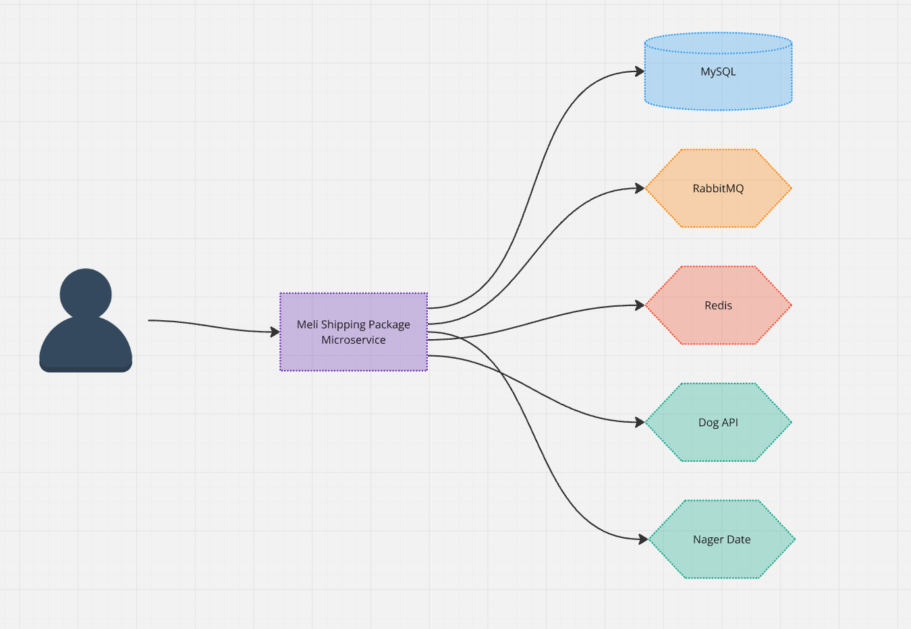
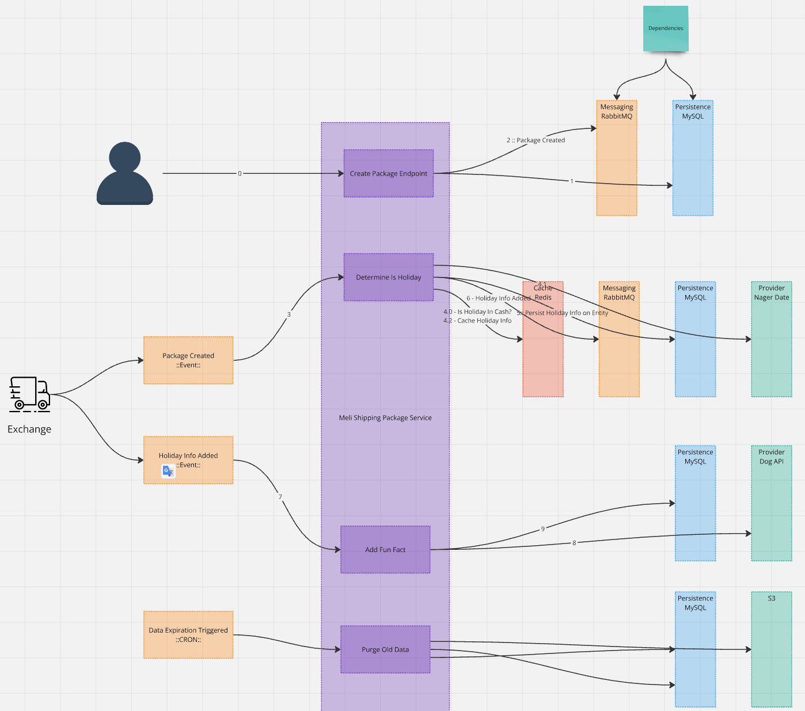
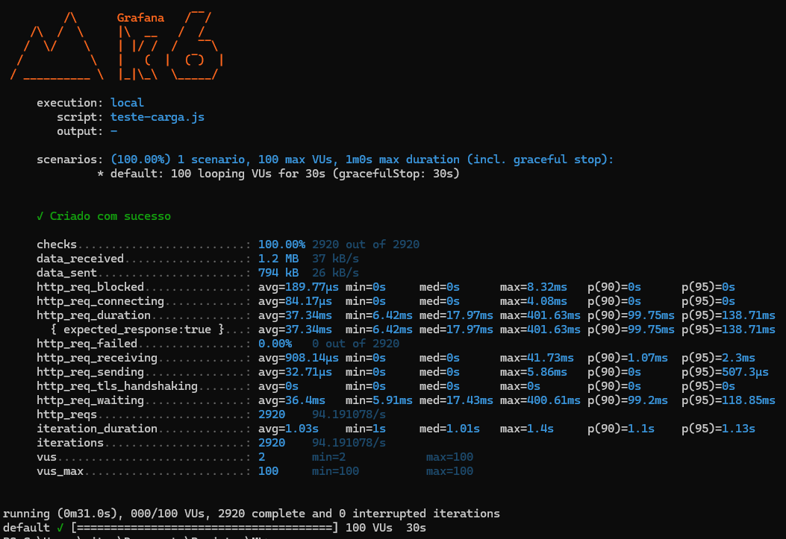

# Inbound - Sistema de Rastreamento de Pacotes

Descrição

Este projeto é um sistema de rastreamento de pacotes desenvolvido com Java Spring Boot. Ele permite o registro e monitoramento de eventos de rastreamento para pacotes, utilizando bancos de dados, cache Redis, filas RabbitMQ e logs estruturados.

Tecnologias Utilizadas

- Java 21
- Spring Boot 3
- Spring Data JPA (com MySql)
- Spring Cache (com Redis)
- RabbitMQ (Mensageria)
- Logback (Configuração de logs)
- JUnit 5 e Mockito (Testes)

# Como Executar o Projeto

Dependências do Projeto

- MySQL
- Redis
- RabbitMQ

## Passos para execução:

1. Clone o repositório:
```

git clone <https://github.com/VitorBrazSilva/logistics.package.inbound.git>

```
2. Execute os serviços necessários:
```
docker-compose up -d
```
3. Verificar a disponibilidade do serviço através do Healthcheck:

```

curl --location 'http://localhost:8080/actuator/health'

```
# Estrutura do Projeto

```
src/main/java/mercadolivre/processoseletivo/Inbound/
│── client/        # Configurações do projeto (Async, Cache, RabbitMQ, etc.)
│── config/        # Configurações do projeto (Async, Cache, RabbitMQ, etc.)
│── controller/    # Endpoints REST
│── entity/        # Entidades JPA
│── repository/    # Repositórios JPA
│── service/       # Regras de negócio
│── util/          # Utilitários, incluindo tratamento global de erros
│── consumer/      # Consumidores RabbitMQ
│── cron/          # Jobs agendados para limpeza de dados

```

Testes

Para rodar os testes unitários:

```
mvn test
```


# Decisões de Design

## Modelagem do Banco de Dados

A modelagem do banco de dados foi feita considerando eficiência nas buscas e integridade dos dados:

- ShippingPackage: Representa um pacote em trânsito.
- TrackingEvent: Registra eventos de rastreamento associados a um pacote.

As entidades possuem relacionamentos bem definidos e indexação para otimizar consultas frequentes.

## Estratégias de Escalabilidade e Otimização

- Cache com Redis: Reduz a carga no banco de dados ao armazenar informações frequentemente acessadas.
- Mensageria com RabbitMQ: Processamento assíncrono de eventos para evitar bloqueios na API.
- Particionamento de Banco: Embora não implementado, uma estratégia futura poderia incluir sharding para distribuir carga.

## Gestão de Threads e Chamadas Assíncronas

- ExecutorService e Spring Async para tarefas paralelas controladas.
- ForkJoinPool para cargas massivas de eventos de rastreamento.
- Job Agendado para expurgo de dados antigos sem impactar a aplicação principal.
  
# Melhorias Futuras

- Monitoramento avançado: Integrar ferramentas como Prometheus e Grafana para métricas de performance.
- Tolerância a falhas: Implementar padrões como Circuit Breaker (Resilience4j) para lidar com falhas de serviços externos.
- Suporte a múltiplas regiões: Replicação de banco e cache distribuído para maior resiliência.

# Diagrama de Dependência dos serviços


# Design System


# Log do K6 testando cenário de alta carga



